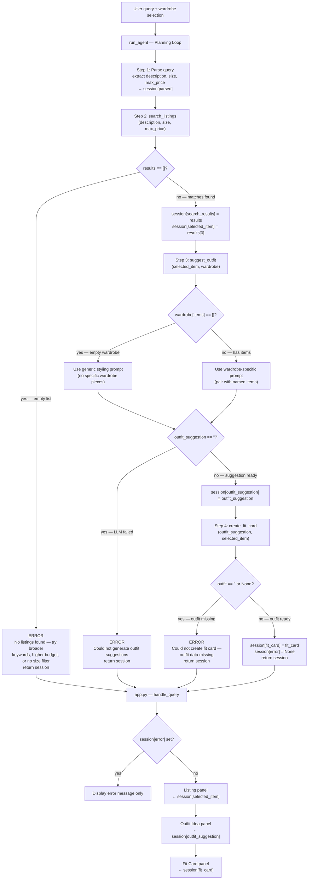

# FitFindr — planning.md

> Complete this document before writing any implementation code.
> Your spec and agent diagram are what you'll use to direct AI tools (Claude, Copilot, etc.) to generate your implementation — the more specific they are, the more useful the generated code will be.
> Your planning.md will be reviewed as part of your submission.
> Update it before starting any stretch features.

---

## Tools

List every tool your agent will use. For each tool, fill in all four fields.
You must have at least 3 tools. The three required tools are listed — add any additional tools below them.

### Tool 1: search_listings

**What it does:**

Loads all 40 listings from `listings.json` via `load_listings()`, filters them by price and size (when provided), scores each remaining listing by counting keyword matches between `description` and the listing's `title`, `description`, `style_tags`, and `category` fields, drops listings with a score of zero, and returns the survivors sorted by score descending.

**Input parameters:**

- `description` (str): Natural language item description to search for (e.g., `"vintage graphic tee"`). Each word is matched against the listing's `title`, `description`, `style_tags` (joined as a space-separated string), and `category`.
- `size` (str | None): Optional size filter. When provided, only listings whose `size` field is an exact case-insensitive match are kept (e.g., `"M"`, `"W30 L30"`, `"US 8"`). When `None`, size is not filtered.
- `max_price` (float | None): Optional price ceiling in dollars. When provided, only listings with `price <= max_price` are kept. When `None`, price is not filtered.

**What it returns:**

A list of listing dicts sorted by keyword relevance (best match first). Each dict contains: `id` (str), `title` (str), `description` (str), `category` (str — one of `tops`, `bottoms`, `outerwear`, `shoes`, `accessories`), `style_tags` (list[str]), `size` (str), `condition` (str — one of `excellent`, `good`, `fair`), `price` (float), `colors` (list[str]), `brand` (str or None), `platform` (str — one of `depop`, `thredUp`, `poshmark`). Returns an empty list `[]` when nothing matches.

**What happens if it fails or returns nothing:**

If the returned list is empty, the agent sets `session["error"] = "No listings found matching your description, size, or budget. Try broader keywords, a higher max price, or leave the size unspecified."` and returns the session immediately. `suggest_outfit` and `create_fit_card` are never called.

---

### Tool 2: suggest_outfit

**What it does:**

Calls the Groq LLM with a prompt that presents the new listing item (title, category, colors, style_tags) and the user's current wardrobe items (name, category, colors, style_tags, notes for each) and asks the model to recommend 1–2 specific outfit combinations. When the wardrobe is empty the prompt asks for general styling ideas instead of wardrobe-specific pairings.

**Input parameters:**

- `new_item` (dict): The selected listing dict from `search_listings`, used for its `title`, `category`, `colors`, `style_tags`, `price`, and `platform` fields.
- `wardrobe` (dict): The user's wardrobe with a top-level `items` key whose value is a list of wardrobe-item dicts, each containing `name`, `category`, `colors`, `style_tags`, and optional `notes`. An empty wardrobe has `items: []`.

**What it returns:**

A plain-text string with 1–2 outfit suggestions. When the wardrobe has items the string names specific pieces (e.g., `"Pair this vintage graphic tee with your baggy straight-leg dark-wash jeans and chunky white sneakers for a laid-back streetwear look. For a layered vibe, add your black cropped zip hoodie over the tee."`). When the wardrobe is empty the string opens with `"Since you haven't added wardrobe items yet, here are general styling ideas: "` followed by the advice.

**What happens if it fails or returns nothing:**

If `wardrobe["items"]` is an empty list, the function continues but uses the empty-wardrobe prompt path (no crash). If the Groq API call raises an exception, the function catches it and returns an empty string `""`. The agent then sets `session["error"] = "Could not generate outfit suggestions. Please try again."` and returns the session without calling `create_fit_card`.

---

### Tool 3: create_fit_card

**What it does:**

Calls the Groq LLM at temperature 0.9 with a prompt that combines the outfit suggestion text and the new item's title, price, and platform to produce a 2–4 sentence Instagram/TikTok-style caption that sounds casual and authentic, mentions where the item was found and what it cost, and captures the outfit's overall aesthetic.

**Input parameters:**

- `outfit` (str): The non-empty outfit suggestion string produced by `suggest_outfit`. The caption is built directly from this text plus item metadata.
- `new_item` (dict): The selected listing dict, used for its `title` (str), `price` (float), and `platform` (str) fields to weave into the caption naturally.

**What it returns:**

A plain-text string containing 2–4 sentences written in casual first-person social-media voice. The caption must: (1) mention the item name and where it was found, (2) include the price naturally (e.g., `"for $22"`), (3) describe the outfit pairing in one sentence, and (4) end with a vibe or mood line. Example: `"snagged this vintage graphic tee off depop for $22 and I'm obsessed. pairs perfectly with baggy dark-wash jeans and chunky white sneakers — effortless streetwear without the effort. low-key the best thrift find this month."`

**What happens if it fails or returns nothing:**

If `outfit` is `None` or an empty string `""`, the function returns the error string `"Could not create a fit card — outfit data was missing or incomplete."` immediately without calling the LLM. The agent stores this string in `session["fit_card"]` and sets `session["error"]` to the same message.

---

### Additional Tools (if any)

None required beyond the three above.

---

## Planning Loop

**How does your agent decide which tool to call next?**

`run_agent(query, wardrobe)` runs a fixed three-step sequence with early-exit checks after each step. There is no dynamic tool selection — the order is always `search_listings → suggest_outfit → create_fit_card`. The conditions below control whether the sequence continues or exits early.

**Step 1 — Parse the query.**
Initialize `session` with keys `query`, `wardrobe`, `parsed`, `search_results`, `selected_item`, `outfit_suggestion`, `fit_card`, `error` (all starting as `None` or empty). Use a Groq LLM call or simple heuristics to extract `description` (required), `size` (optional), and `max_price` (optional) from `query`. Store in `session["parsed"]`.

**Step 2 — Call `search_listings`.**
Call `search_listings(description, size, max_price)`. Store the returned list in `session["search_results"]`.
- If `session["search_results"]` is an empty list: set `session["error"] = "No listings found matching your description, size, or budget. Try broader keywords, a higher max price, or leave the size unspecified."` and `return session` immediately. Steps 3 and 4 are skipped.
- If `session["search_results"]` is non-empty: set `session["selected_item"] = session["search_results"][0]` and continue.

**Step 3 — Call `suggest_outfit`.**
Call `suggest_outfit(session["selected_item"], session["wardrobe"])`. Store the result string in `session["outfit_suggestion"]`.
- If `session["outfit_suggestion"]` is falsy (empty string or None): set `session["error"] = "Could not generate outfit suggestions. Please try again."` and `return session` immediately. Step 4 is skipped.
- If `session["outfit_suggestion"]` is a non-empty string: continue.

**Step 4 — Call `create_fit_card`.**
Call `create_fit_card(session["outfit_suggestion"], session["selected_item"])`. Store the result in `session["fit_card"]`.
- If `session["fit_card"]` is falsy: set `session["error"] = "Could not create fit card — outfit data was missing or incomplete."` and `return session`.
- Otherwise: `return session` with all fields populated and `error = None`.

The agent knows it is "done" when it returns the session. There is no loop — the sequence runs once per user query.

---

## State Management

**How does information from one tool get passed to the next?**

All inter-tool data is stored in a single `session` dict that is initialized at the start of `run_agent` and mutated in place as each step completes.

- `session["query"]` (str): The raw user query. Set once at initialization, never changed.
- `session["wardrobe"]` (dict): The wardrobe dict passed in by the caller (app.py). Set once at initialization.
- `session["parsed"]` (dict): Contains `description` (str), `size` (str|None), `max_price` (float|None) extracted from the query. Written in Step 1, read by Step 2.
- `session["search_results"]` (list[dict]): Full ranked list of matching listings returned by `search_listings`. Written in Step 2, not read by downstream tools (they use `selected_item` instead).
- `session["selected_item"]` (dict|None): The first element of `search_results` (`results[0]`). Written in Step 2, read by Steps 3 and 4.
- `session["outfit_suggestion"]` (str|None): The plain-text outfit advice returned by `suggest_outfit`. Written in Step 3, passed as the `outfit` argument to `create_fit_card` in Step 4.
- `session["fit_card"]` (str|None): The social-media caption returned by `create_fit_card`. Written in Step 4, surfaced to the UI.
- `session["error"]` (str|None): Set to a user-facing error message whenever an early exit occurs. The UI checks this field first; if it is set, only the error message is displayed.

`app.py`'s `handle_query()` reads `session["selected_item"]`, `session["outfit_suggestion"]`, `session["fit_card"]`, and `session["error"]` to populate the three output panels and any error display.

---

## Error Handling

For each tool, describe the specific failure mode you're handling and what the agent does in response.

| Tool            | Failure mode                          | Agent response |
| --------------- | ------------------------------------- | -------------- |
| search_listings | No results match the query            | Set `session["error"] = "No listings found matching your description, size, or budget. Try broader keywords, a higher max price, or leave the size unspecified."` and return session immediately — outfit and fit-card steps are skipped entirely. |
| suggest_outfit  | Wardrobe is empty                     | Continue with a modified LLM prompt that does not reference specific wardrobe pieces. The returned string opens with `"Since you haven't added wardrobe items yet, here are general styling ideas: "`. No error is set; the flow continues to `create_fit_card`. |
| create_fit_card | Outfit input is missing or incomplete | If `outfit` is empty/None, return the error string `"Could not create a fit card — outfit data was missing or incomplete."` without calling the LLM. Set `session["error"]` to that string and store the same string in `session["fit_card"]` so the UI has something to display. |

---

## Architecture



**Session state fields (shared across all steps):**

```
session = {
    "query":             str,        # raw user query
    "wardrobe":          dict,       # {"items": [...]}
    "parsed":            dict,       # {"description": str, "size": str|None, "max_price": float|None}
    "search_results":    list[dict], # all matching listings, ranked
    "selected_item":     dict|None,  # search_results[0]
    "outfit_suggestion": str|None,   # output of suggest_outfit
    "fit_card":          str|None,   # output of create_fit_card
    "error":             str|None,   # set on any early exit
}
```

---

## AI Tool Plan

**Milestone 3 — Individual tool implementations:**

**Tool 1 — `search_listings`:**
I'll give Claude the Tool 1 spec block from this file (what it does, all three input parameters with types and meanings, the return-value description, and the failure mode) plus the listing schema from the Explore section (the 11 fields in each listing dict). I'll ask it to implement the function using `load_listings()` from `utils/data_loader.py`, filtering first by price and size, then scoring by keyword frequency across `title`, `description`, `style_tags`, and `category`. Before trusting it I'll verify: (1) filtering by `max_price=25` drops all listings priced above $25, (2) filtering by `size="M"` drops non-M listings, (3) `description="vintage graphic tee"` returns at least one result, and (4) a nonsense description like `"zzzxxx"` returns `[]`.

**Tool 2 — `suggest_outfit`:**
I'll give Claude the Tool 2 spec block (inputs, return value, empty-wardrobe behavior) and the wardrobe schema (the `items` list structure with `name`, `category`, `colors`, `style_tags`, `notes` fields). I'll ask it to write the Groq prompt that lists wardrobe items and the new item and requests 1–2 outfit combinations in 2–3 sentences, with a separate prompt path when `items` is empty. Before trusting it I'll check: (1) calling with the example wardrobe produces text that names at least one specific wardrobe piece, (2) calling with an empty wardrobe returns a string starting with the expected "Since you haven't added wardrobe items yet..." prefix, and (3) no unhandled exceptions are raised on either path.

**Tool 3 — `create_fit_card`:**
I'll give Claude the Tool 3 spec block (inputs with types, the four requirements for the caption, and the empty-outfit guard) and a sample target output (the example caption in this file). I'll ask it to call Groq at `temperature=0.9` and use a system prompt that tells the model to write in casual first-person Instagram voice. Before trusting it I'll check: (1) the output is 2–4 sentences, (2) it includes the item's platform and price, (3) passing `outfit=""` returns the error string without calling Groq, and (4) running it three times produces noticeably different captions (temperature test).

**Milestone 4 — Planning loop and state management:**

I'll give Claude the Architecture diagram from the `## Architecture` section of this file (the full ASCII diagram plus the session-fields table) and the Planning Loop section (all four numbered steps with the conditional logic). I'll ask it to implement `run_agent(query, wardrobe)` in `agent.py` exactly as diagrammed, with `session` initialized as shown, each step's early-exit guard in place, and `selected_item = search_results[0]` set before calling `suggest_outfit`. Before trusting it I'll run three end-to-end tests: (1) a query that matches listings with a wardrobe — verify all four session fields are non-None and `error` is None; (2) a query that matches nothing — verify `error` is set and `outfit_suggestion` and `fit_card` are still None; (3) a query that matches listings with an empty wardrobe — verify `outfit_suggestion` starts with the "Since you haven't added..." prefix and `fit_card` is non-None.

---

## A Complete Interaction (Step by Step)

Write out what a full user interaction looks like from start to finish — tool call by tool call. Use a specific example query.

**Example user query:** "I'm looking for a vintage graphic tee under $30. I mostly wear baggy jeans and chunky sneakers. What's out there and how would I style it?"

**Step 1 — Parse the query.**
`run_agent` initializes session and parses the query. It extracts `description = "vintage graphic tee"`, `size = None` (no size mentioned), and `max_price = 30.0` (from "under $30"). These are stored in `session["parsed"]`.

**Step 2 — Call `search_listings`.**
`search_listings("vintage graphic tee", size=None, max_price=30.0)` is called. `load_listings()` returns all 40 listings. Price filter drops any listing with `price > 30.0`. No size filter is applied. Keyword scoring counts how many words from `"vintage graphic tee"` appear in each remaining listing's `title`, `description`, `style_tags`, and `category`. Listings with a score of 0 are dropped. The survivors are sorted by score. Suppose the result is a list of 4 items, with the top result being:
```
{ "id": "lst_012", "title": "Vintage Band Tee — Faded Black",
  "category": "tops", "style_tags": ["vintage", "graphic tee", "grunge", "90s"],
  "size": "M", "condition": "good", "price": 22.00,
  "colors": ["black"], "brand": null, "platform": "depop" }
```
`session["search_results"]` is set to the 4-item list. `session["selected_item"]` is set to the item above. Because `search_results` is non-empty, the loop continues.

**Step 3 — Call `suggest_outfit`.**
`suggest_outfit(selected_item, wardrobe)` is called with the "Vintage Band Tee" dict and the example wardrobe (10 items including baggy jeans, chunky white sneakers, black cropped zip hoodie, etc.). The Groq prompt lists all wardrobe items and asks for 1–2 outfit combinations. Groq returns:
```
"Pair this faded vintage band tee with your baggy straight-leg dark-wash jeans and chunky white sneakers for an effortless 90s streetwear look. For an edgier take, swap in your black combat boots and layer your vintage black denim jacket on top."
```
`session["outfit_suggestion"]` is set to this string. Because it is non-empty, the loop continues.

**Step 4 — Call `create_fit_card`.**
`create_fit_card(outfit_suggestion, selected_item)` is called. The Groq prompt (temperature 0.9) receives the outfit text plus `title = "Vintage Band Tee — Faded Black"`, `price = 22.00`, `platform = "depop"`. Groq returns:
```
"found this faded vintage band tee on depop for $22 and honestly it just works. wearing it with baggy dark-wash jeans and chunky white sneakers — pure 90s streetwear, zero effort. add a black denim jacket and combat boots when you want to go full grunge. thrift wins only."
```
`session["fit_card"]` is set to this string. `session["error"]` remains `None`.

**Final output to user.**
`handle_query()` in `app.py` reads the session and populates all three output panels:
- **Listing panel**: `"Vintage Band Tee — Faded Black | depop | $22.00 | Size M | Condition: good"`
- **Outfit Idea panel**: The two-sentence wardrobe pairing from `outfit_suggestion`.
- **Fit Card panel**: The four-sentence caption from `fit_card`.

If `search_listings` had returned an empty list at Step 2, `session["error"]` would have been set to `"No listings found matching your description, size, or budget. Try broader keywords, a higher max price, or leave the size unspecified."` and the agent would have returned immediately. `handle_query()` would detect `session["error"] != None` and display only that message, leaving the listing, outfit, and fit-card panels empty.
